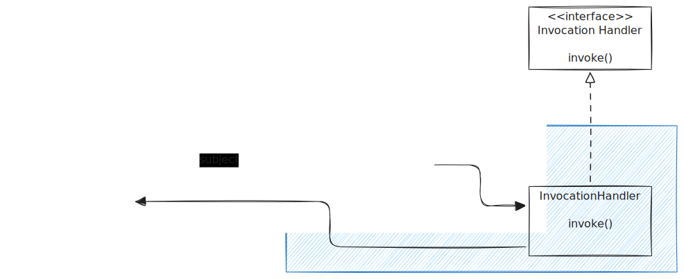

# Design Pattern Proxy


- 정의
  - 특정 객체로 의 접근을 제어하는 대리인을 제공
- 종류
  - 원격 프록시(Remote proxy)
  - 가상 프록시(Virtual proxy)
  - 동적 프록시(Dynamic proxy)
  - 보호 프록시(Protection proxy)
- 비교
  - 데코레이터 패턴 : 새로운 행동을 추가 vs. 어떤 클래스로 접근 제어
  - 어댑터 패턴 : 인터페이스를 바꾸기 vs. 동일한 인터페이스 사용


## 원격 프록시


 
## 동적 프록시

### 클래스 다이어그램




### 코드 예제


**공통 인터페이스 :**

```java
public interface Service {
    void sayHello();
}
```

**실제 객체 :**

```java
public class RealService implements Service {
    public void sayHello() {
        System.out.println("안녕하세요! 저는 진짜 서비스입니다.");
    }
}
```

**InvocationHandler 구현 :**


```java
import java.lang.reflect.*;

public class ServiceInvocationHandler implements InvocationHandler {
    private Object realService;

    public ServiceInvocationHandler(Object realService) {
        this.realService = realService;
    }

    public Object invoke(Object proxy, Method method, Object[] args) throws Throwable {
        // 호출 전 행동
        System.out.println("[프록시] 메서드 실행 전: " + method.getName());

        // 실제 객체 메서드 실행
        Object result = method.invoke(realService, args);

        // 호출 후 행동
        System.out.println("[프록시] 메서드 실행 후: " + method.getName());

        return result;
    }
}
```


**프록시 생성 및 실행 :**

```java
import java.lang.reflect.*;

public class ProxyTest {
    public static void main(String[] args) {
        // 실제 객체 생성
        Service realService = new RealService();

        // 프록시 생성
        Service proxyInstance = (Service) Proxy.newProxyInstance(
            realService.getClass().getClassLoader(),
            realService.getClass().getInterfaces(),
            new ServiceInvocationHandler(realService)
        );

        // 프록시 호출
        proxyInstance.sayHello();
    }
}
```

**실행결과 :**

```less
[프록시] 메서드 실행 전: sayHello
안녕하세요! 저는 진짜 서비스입니다.
[프록시] 메서드 실행 후: sayHello
```

- `Proxy.newProxyInstance()` -> 프록시 객체 생성
- `InvocationHandler` -> 메서드 호출 가로채기
- 호출 전/후에 트랜잭션, 로깅, 권한 체크 등 로직 삽입 가능