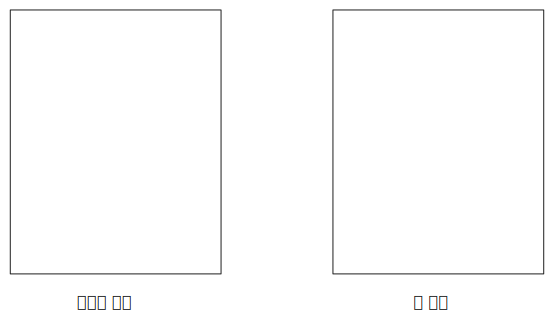

# Java Basic

## Java 메모리 구조

 
- 예) 자바에서 특정 클래스로 100개의 인스턴스 생성
  - 힙 메모리에 100개의 인스턴스 생성
  - 각각의 인스턴스는 내부에 변수와 메서드를 가짐
  - 각 인스턴스 변수에 메모리 할당
  - 메서드에 대한 새로운 메모리 할당은 없음
  - 메서드는 공통된 코드를 공유하기 때문

## 변수와 생명 주기

- 지역 변수 (매개변수 포함)
  - 스택 프레임 안에 보관
  - 메서드 종료시 (=스택 프레임 제거시) 지역 변수도 함께 제거
- 인스턴스 변수
  - 힙 영역을 사용
  - GC가 발생하기 전까지 생존
- 클래스 변수
  - 메서드 영역의 static 영역에 보관
  - JVM에 로딩되는 순간 생성, JVM 종료될때 까지 생존

### 비교

- 생명 주기 : 클래스 변수 > 인스턴스 변수 > 지역 변수(매개변수)
