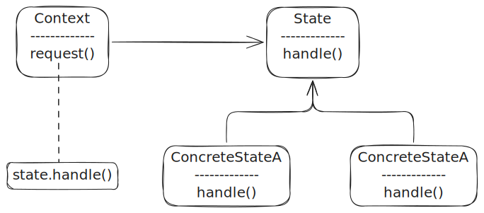

# 상태 패턴 (State Pattern)

- 객체의 내부 상태가 바뀜에 따라서 객체의 행동을 바꿀 수 있다

- 추상 클래스, 인터페이스를 이용하여 State 클래스를 구현
  - 추상 클래스를 사용하면 구상 클래스 코드를 수정하지 않고 추상 클래스에 메소드 추가 가능

## 전략 패턴 vs. 상태 패턴

- 전략패턴은 바꿔쓸 수 있는 알고리즘 기반
- 상태패턴은 내부 상태를 바꿈으로써 객체가 행동을 바꿀 수 있도록 도움

## In Practice

- 휴가가 어색하다

## 질문

- 왜 전략패턴과 상태패턴이 비교되는가?
