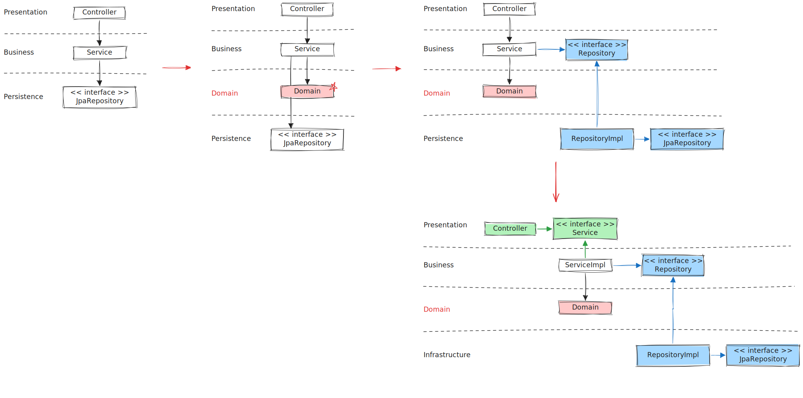

# 클린 아키텍처

- [레이어드 아키텍처의 단점](#레이어드-아키텍처의-단점)
- [개선된 아키텍처](#개선된-아키텍처)

## 레이어드 아키텍처의 단점

1. DB 주도 설계를 유도한다
2. 의존성에 대한 고민을 유도하지 않는다
3. 도메인이 죽는다 : 서비스에서 모든 로직을 처리 Fat Service
4. 동시 작업이 불가하다
5. 규모가 커질수록 확장성이 떨어진다

-> 절차지향적 사고 유도 -> 낮은 Testability & Bad SOLID

## 개선된 아키텍처

