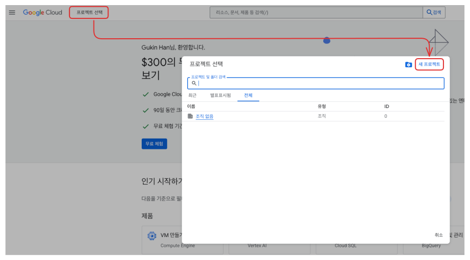
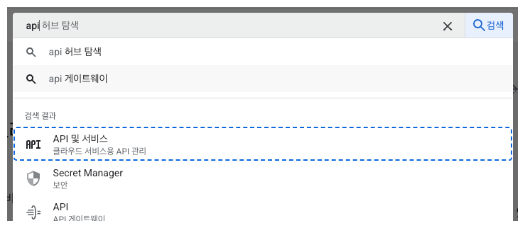
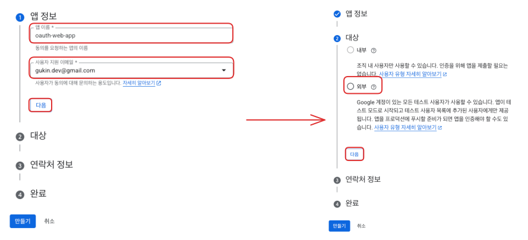
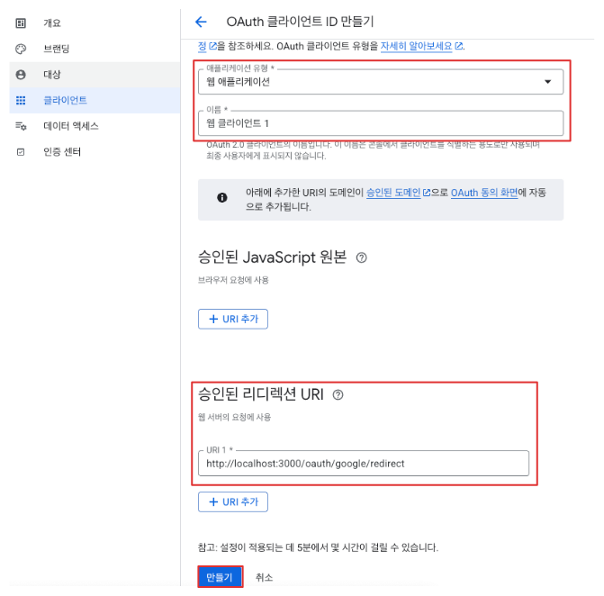
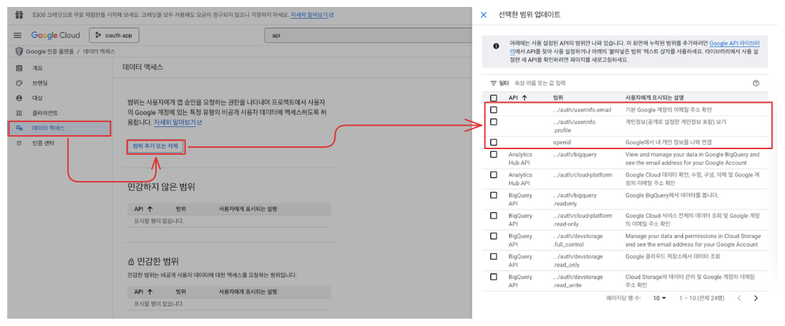
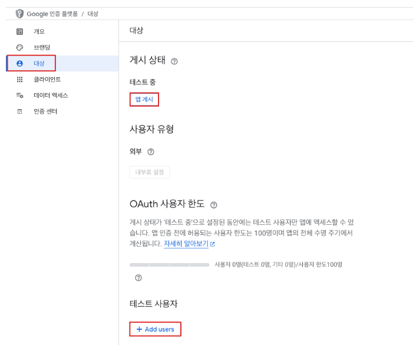

# Security OAuth2

## 구글 로그인 (콘솔 작업)

1. [구글 클라우드 콘솔](https://console.cloud.google.com/) 접속

2. 새로운 프로젝트 생성. 프로젝트 이름을 입력하고 생성

3. 생성된 프로젝트를 선택

4. API 및 서비스 선택

5. sidebar에서 OAuth 동의화면 클릭. 시작하기 클릭

6. 프로젝트 구성 설정하기. 값 입력 후 만들기 클릭.

7. `OAuth 개요 > 측정항목` 에서 OAuth 클라이언트 만들기 클릭

8. OAuth 클라이언트 ID 만들기

- 승인된 리디렉션 URI(프론트)로 인가코드를 전달
- 예) `http://localhost:3000/oauth/google/redirect?code=XXXX`
- 두개 이상인 경우 보낸쪽에 반환한다

9. 클라이언트 보안 비밀번호 우측 JSON 다운로드 체크

- client_id, client_secret : 인가코드를 받기 위한 데이터
- auth_uri, token_uri : 공통적으로 사용되는 URI

10. 좌측 사이드바 데이터 액세스 및 스코프 설정

- 가장 빈번하게 사용되는 범위(scope)는 아래와 같음 :
   - email
   - profile
   - openid
- 그외 스코프는 필요에 따라 설정 

11. 좌측 사이드바 대상

- 앱 게시 혹은 테스트 사용자 설정
- 프로덕션 설정되면 데이터 액세스에서 별도의 스코프를 추가할 수 있음
- 별도의 스코프는 구글의 승인을 받아야 함
- 프로덕션 레디가되면 초기화되기 때문에 다시 10번 항목으로 돌아가서 스코프 설정을 해야함