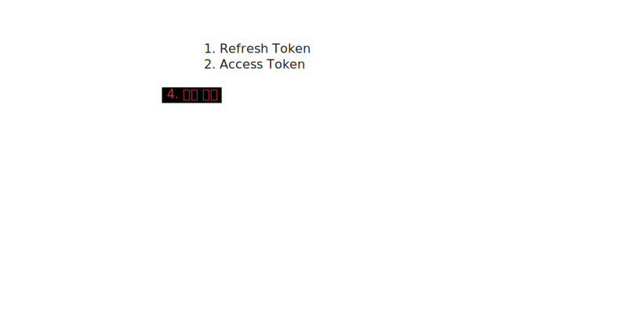
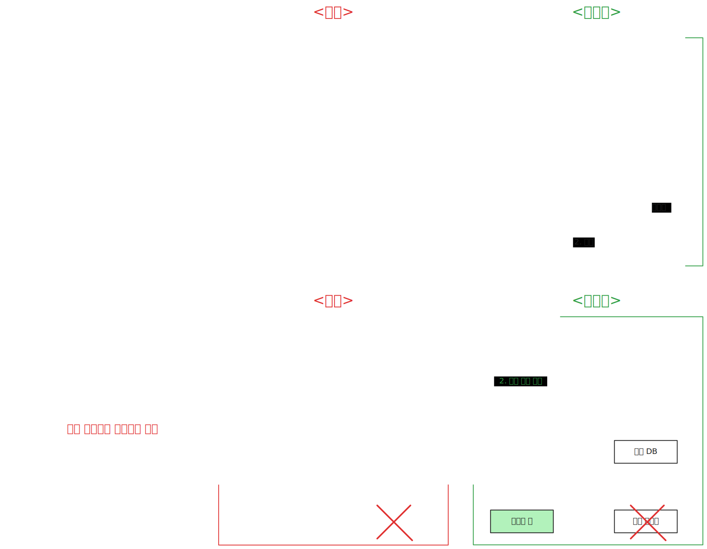

# Redis Basic

## Docker 기반 실행환경 세팅

1. docker desktop 설치: https://www.docker.com/

2. 도커컨테이너 실행. 터미널에서 아래 커맨드 입력 :

```shell
docker run --name redis-cli-test -p 6379:6379 -d redis
```

3. 도커, 레디스 CLI 접속. 터미널에서 아래 커맨드 입력 :

```shell
docker exec -it redis-cli-test redis-cli
```

## DB

```shell
select 10
select 0
select 16
```

- 인덱스 0 부터 15 번호로 관리 (16개 DB)
- 구분하는 목적
  - 0: 인증, 1: 캐싱, 2: 상품 목록(재고) 등 하나의 레디스 서버를 다양한 목적으로 사용
  - 유용하며, 실무에서 실제로 사용하는 방식
  - 각 번호별로 이름을 붙일 수 없나?
- 0번은 [] 표시하지 않는다
- 참고) https://redis.io/docs/latest/commands/select/


## String


### String 구조에서 key-value


```shell
// 키-값 세팅
set user:email:1 gukin.dev@gmail.com
set user:email:2 gukin.dev@gmail.com

// 데이터베이스 내의 모든 키값을 조회
keys *

// 값을 조회
get user:email:1
```

- 콜론(:)을 이용한 key 네이밍 컨벤션
- 같은 key에 set하면 덮어씌워지는(overwrite) 방식
  - nx(=if not exists) 명령어를 마지막에 붙이면 overwrite 방지
  - 예) `set user:email:1 gukin.dev@gmail.com nx` 

### key-value 삭제

```shell
set user:email:1 key1
set user:email:2 key2
set user:email:3 key3

# 특정 key 삭제
del user:email:1

# 현재 DB내 모든 key 삭제
flushdb
```

- `del {key}` 커맨드 사용


### 유효기간 설정


- redis를 사용하는 목적을 고려해보면
  - 빠른 성능
  - 일시성 (in-memory)
  - 적은 용량

```shell
set user:eamil:3 gukin.dev@gmail.com ex 10
```

- `ttl` (time to live)
- `ex` expiration
- 단위는 seconds


### String 실무활용1 : 인증정보 저장 (Auth)



```shell
set user:1:refresh_token eyjaxabaalsdkal ex 100000
```

- Redis 활용
  - 사용자 인증정보 저장(ex-refresh토큰)
- 나중에 혹은 별도로 특정 key에 만료시간을 부여하는 방법
  - `expire {key} 3600`
- 로그인을 하는 경우 저장되도록 trigger
- 스네이크 케이스 (refresh_token)
- keys 명령어는 성능 문제를 초래하기 때문에 운영환경에서는 사용하지 않는게 좋음


### String 실무활용2 : 좋아요 기능 (Count)

- RDB에서 좋아요를 관리하면 동시성 문제가 발생할 수 있다
  - 멀티 스레딩을 지원한다는 것이 문제가 발생할 수 있게 한다
  - 인기 있는 게시글을 동시에 좋아요를 누르는 경우
  - 동시에 select를 했을 때
  - select-update을 하나의 트랜잭션으로 실행시키는 경우, 속도가 느린가?
- 반면에, Redis는 싱글 스레드이며 한 번에 하나의 작업을 빠르게 처리할 수 있기 때문

```shell
set likes:posting:1 0
incr likes:posting:1 #특정 key값의 value를 1만큼 증가
decr likes:posting:1 #특정 key값의 value를 1만큼 감소
get likes:posting:1
```

- 참고) 위와 같은 명령어는 각 어플리케이션에서 라이브러리를 활용함

### String 실무활용3 : 재고 관리 (Count)

> 좋아요와 비슷한 방식

- RDB로 관리하면 문제가 발생한다
  - 동시에 주문을 넣는 경우
  - **갱신 이상**이 발생한다

```shell
set stocks:product:1 100
decr stocks:product:1
get stocks:product:1
```

### String 실무활용4: 캐싱

- 캐싱은 임시저장이라고 생각할 수도 있다
- TTL을 이용해서 만료기간을 설정한 설계를 염두
- **참고)** JSON 형태로 Redis에 저장하면 프로그램에서 역직렬화하기 용이함


```shell
set posting:1 "{\"title\":\"hello java\", \"contents\":\"hello java is ...\"}"
```

* 참고) `\` 이스케이프 문자를 쌍따옴표 앞에 넣는다


## List 

- deque (double-ended queue) 유사한 구조
	- 리스트는 중간에 데이터를 넣을 수 있지만 shift로 인한 성능 문제가 있음
		- Redis List 자료구조는 지원하지 않음
	- 대신 양쪽 끝에 데이터를 넣는 방식이 효율적
	- 조회도 유사

```shell
# 데이터를 왼쪽 끝에 삽입/조회
lpush
lpop

# 데이터를 오른쪽 끝에 삽입/조회
rpush
rpop
```


```shell
lpush testlist test1
lpush testlist test2
rpush testlist test3

lrange testlist 0 -1 # -1은 끝 인덱스
```


### 리스트 조회

```shell
# -1은 리스트 끝자리
# -2은 리스트 끝에서 두 번째 자리
lrange testlist 0 0 # 첫 번째 값만 조회
lrange testlist -1 -1 # 마지막 값만 조회
lrange testlist 0 -1 # 처음 부터 끝까지
lrange testlist -2 -1 # 마지막 2번째부터 마지막 자리까지 (역순)
```

- negative를 사용하는 이유는 끝 인덱스를 모르는 경우가 있기 때문


### 데이터 개수 조회

```shell
llen testlist
```


### TTL 적용**

```shell
expire testlist 5

# TTL 시간 조회
ttl testlist
```

### 실무활용1 : 최근 방문한 페이지, 최근 조회한 상품목록


- 첫 번째 페이지, 두 번째 페이지, 세 번째 페이지
  - 최근 방문한 두 페이지 반환 (두 번째, 세 번째 페이지)
- 팝은 언제할지 고민해볼것
- 비동기 처리 대기열에 사용되지만, 메모리 기반이기 때문에 실패해도 괜찮은 경우 사용 가능

```shell
rpush user:1:recent-page www.naver.com/blogs/1
rpush user:1:recent-page www.naver.com/blogs/5
rpush user:1:recent-page www.naver.com/blogs/31 # -3
rpush user:1:recent-page www.naver.com/blogs/48 # -2
rpush user:1:recent-page www.naver.com/blogs/200 # -1

# 최근 방문한 페이지 3개만 보여주는
lrange user:1:recent-page -3 -1
```

- 조회 결과 31, 48, 200 순서로 나타난다
- 순서가 보장 + 중복 제거 -> zset
  - 목적은? **최근 조회한 상품 목록인 경우에 요구될 수 있음**


## Set

* 수학적 정의의 SET과 동일
	* 중복이 없다
	* 순서가 없다

```shell
# set add
sadd memberset member1
sadd memberset member2
sadd memberset member3

# set 조회 - set의 member
smembers memberlist

# set 요소의 개수 조회 (cardinaliy)
scard memberlist

# set에서 멤버 제거 (remove)
srem memberlist member2

# 특정 요소가 set안에 들어있는지 확인 (is Member)
sismember memberlist member1
```


### 실무활용1 : 좋아요 (count)


- list 방식의 좋아요의 문제점
  - 특정 유저에 대한 중복 데이터가 삽입될 수 있음
  - 인메모리에서 좋아요를 구현해도 괜찮은건가?

```shell
sadd likes:posting:1 member1
sadd likes:posting:1 member2
sadd likes:posting:1 member1

# 좋아요 개수 구하기
scard likes:posting:1

# 특정 유저(member1)가 좋아요를 눌렀는지 안눌렀는지 확인
sismember likes:posting:1 member1
```

- 실제로 적용할만한가?
- 또다른 활용
  - 매일 방문자수 계산
  - 좋아요 수 중복없이 집계


## ZSet

- 정렬된 집합(sorted  set)
  - z는 정렬을 의미
- 정렬 기준점(score)를 제공해야함
  - add 시점에 정렬

```shell
# add 시점에 score를 부여, score를 기준으로 정렬
zadd memberlist 3 member1
zadd memberlist 4 member2
zadd memberlist 1 member3
zadd memberlist 2 member4

# 기본 조회방법 (스코어 기준 오름차순)
zrange memberlist 0 -1
```

```shell
# 내림차순 정렬
zrevrange memberlist 0 -1

# zset 요소 삭제
zrem memberlist member4

# 특정 멤버가 몇 번째 순서인지 출력 (오름차순 기준순)
zrank memberlist member3
```

### 실무활용 1 : 최근 본 상품 목록

- 최근 방문한 페이지, 최근 조회한 상품목록
  - 중복 제거, 최근 (조건)
  - SET은 활용할 수 없고 ZSET을 활용
  - **score는 조회한 시간을 부여 (초로 환산해서)**

```shell
zadd recent:products 151930 pineapple
zadd recent:products 152030 banana
zadd recent:products 152130 orange
zadd recent:products 152230 apple
zadd recent:prodcuts 152330 apple # 같은 상품을 add하는 경우 score만 업데이트

# 최근 본 상품목록 3개 조회
zrevrange recent:products 0 2
```

- 기타 활용
  - 주식, 코인 등의 실시간 시세저장 (RDB에 저장하기에는 너무 큰 단위)
    - `zadd stock:samsung {시간} 53000`
  - 게임 등의 사용자의 점수나 순위를 관리


## Hash

- value값이 map 형태 (key-value의 리스트 구조)

```shell
# hash: map 형태
hset member:info:1 name hong email hong@naver.com age 30

# 조회
hget member:info:1 name

# 전체 조회
hgetall member:info:1

# 특정 요소값 수정
hset member:info:1 name kim

# 특정 요소값의 값을 증가/감소
hincrby member:info:1 age 5
hincrby member:info:1 age -5
```

**결과**
```text
127.0.0.1:6379[1]> hset member:info:1 name hong email test@gmail.com age 10
(integer) 3
127.0.0.1:6379[1]> hset member:info:1 name
(error) ERR wrong number of arguments for 'hset' command
127.0.0.1:6379[1]> hget member:info:1 name
"hong"
127.0.0.1:6379[1]> hget member:info:1 email
"test@gmail.com"
127.0.0.1:6379[1]> hgetall member:info:1
1) "name"
2) "hong"
3) "email"
4) "test@gmail.com"
5) "age"
6) "10"
127.0.0.1:6379[1]> hset member:info:1 name han
(integer) 0
127.0.0.1:6379[1]> hgetall member:info:1
7) "name"
8) "han"
9) "email"
10) "test@gmail.com"
11) "age"
12) "10"
127.0.0.1:6379[1]>
```

**String vs. Hash**

- 캐싱 처리시 플랫한 데이터 예) 상품의 재고, 가격 등을 묶는 목적으로 사용 가능
- String 자료구조도 JSON 형태로이지만 String 묶음
	- 중간 요소를 수정하기 위해 파싱/덮어쓰기를 해야하기 때문에 복잡도가 올라감
- 프로그램 내에서 **오브젝트를 캐싱하는 경우** json, hash로 할지에 대한 결정이 필요
- 값이 빈번하게 변경되는 경우 hash를 써서 최적화할 수 있고, 자주 조회되는 경우 json
	- hash와 json의 다른 차이점은 없나?


## pub/sub

생략. 나중에 추가


## Stream

- pub/sub과 다르게 메시지가 저장됨
- 실시간으로 메시지를 받아옴
- stream은 자료구조
- 활용
  - ❌ 이벤트 기반 시스템 -> 카프카를 대신 사용
  - ✅ 채팅 및 알림 시스템
- 결론
  - stream 대신 kafka를 활용
  - kafka가 더 안정성이 보장되고, 다양한 기능을 제공

- `xadd test_stream * message "Hello, this is a test message"`
  - `xadd` : redis stream에 데이터를 추가할 때 사용
  - `test_stream` : 스트림 이름
  - `*` : 메시지의 고유ID를 Redis가 자동 생성
- `xread block 10000 streams test_stream $`
  - `block 10000`: 최대 10초 (10000ms) 동안 대기
  - `$` : 현재 마지막 페이지 이후에 오는 새 메시지를 기다림 
- `xrange test_stream - +`
  - `xrange` 명령어는 redis stream에서 메시지를 조회할 때 사용
  - `-` : 시작 범위 (처음부터)
  - `+` : 끝 범위 (끝까지)



- MSA 환경에서 비동기 통신으로 클라이언트에 대한 응답 속도를 높일 수 있다
	- 업데이트는 비동기 통신으로 수행
- 서버가 다운되는 경우 서비스간 통신이 카프카에 저장되기 때문에 retry 등의 안정성 확보


## Redis 서버 구성


- 마스터 슬레이브 구조
  - 단순한 복제 목적으로 사용하는 방식은 의미 없음
  - 마스터는 저장, 슬레이브는 복제
  - 부하 분산
    - 마스터는 쓰기
	- 슬레이브는 읽기
- 클러스터
  - 추가적인 설정과 구성 필요
  - 여러 마스터, 여러 슬레이브
  - 샤딩을 사용


## References


1. https://picturesque-staircase-f6e.notion.site/redis-773bcaf9230047fdb12a874d216f1345
2. https://medium.com/nerd-for-tech/unveiling-the-art-of-redis-key-naming-best-practices-6e20f3839e4a
3. https://youtu.be/BuYfhzJrBTo?si=nRg2B92G9gjvRNys
4. https://en.wikipedia.org/wiki/Redis
